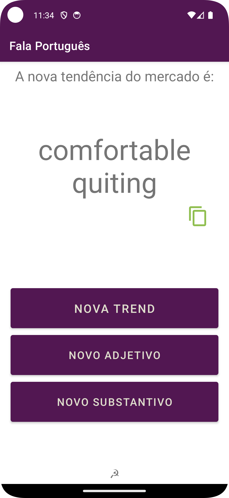
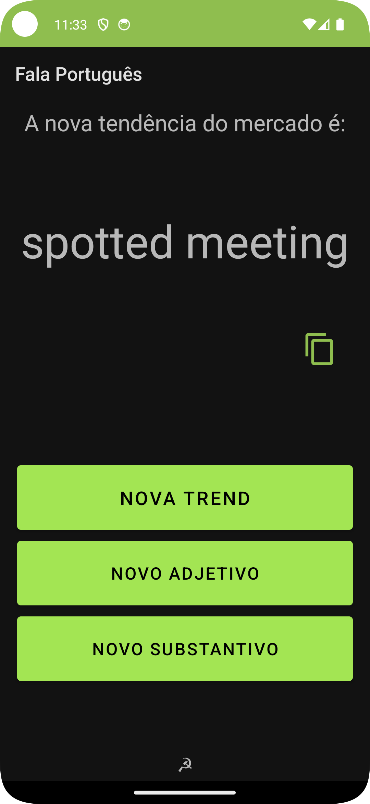
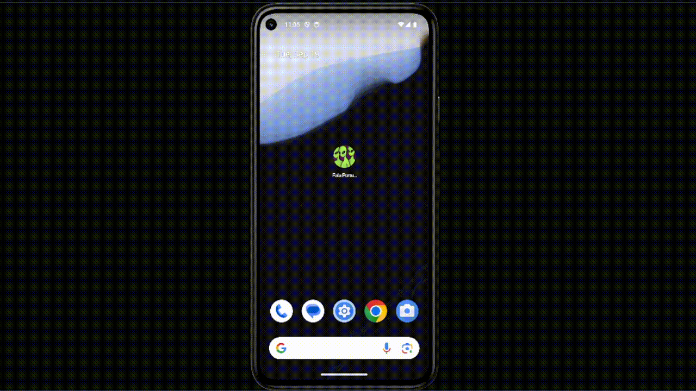

# falaportugues - mobile version

    <table>
        <tr>
            
            
        </tr>
    </table>

APP to generate new workspace trend name compose
by a random adjective followed by a [workspace related noun](./app/src/main/assets/job-nouns.json).

Powered by [words-api](https://github.com/dulldesk/words-api)
inspired on the amazing work: [falaportugues](https://github.com/JMoicano/falaportugues)

## Demo

